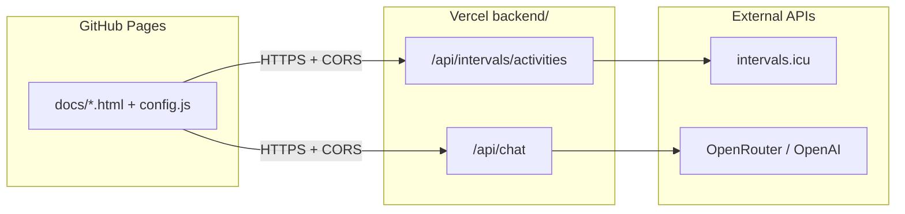

# Strava / Intervals training dashboard

Static sports maps and an **Intervals.icu** CTL dashboard with an AI coach. Frontend is hosted on **GitHub Pages**; secrets and upstream APIs run on **Vercel** serverless functions.

## Architecture



- **Frontend** (`docs/`): no API keys for intervals.icu or AI; only `API_BASE` and optional site gate token in `config.js`.
- **Backend** (`backend/`): Node 20 serverless only — see [DEPLOY.md](./DEPLOY.md).
- **Python** (`scripts/`, `requirements.txt`): GitHub Actions for Strava GeoJSON updates — not deployed to Vercel.

## Quick links

- [Deployment guide](./DEPLOY.md)
- [Backend env template](./backend/.env.example)
- [Frontend config example](./docs/config.example.js)

## Local development

- Open `docs/metricsintervals.html` via GitHub Pages or a static server; set `docs/config.js` `API_BASE` to your deployed Vercel URL.
- Run API locally with Vercel CLI from `backend/`:

```bash
cd backend
npx vercel dev
```

Set env vars in `backend/.env` (gitignored) or via the Vercel dashboard.
